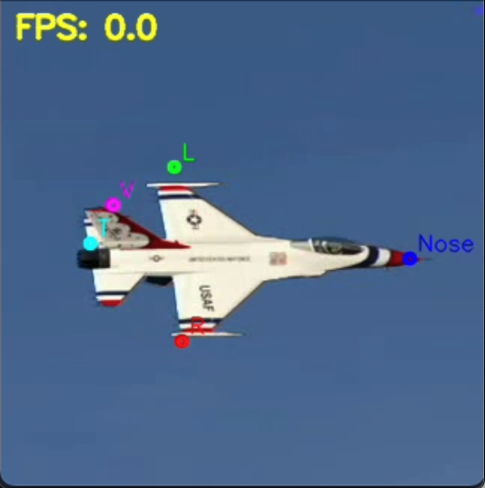
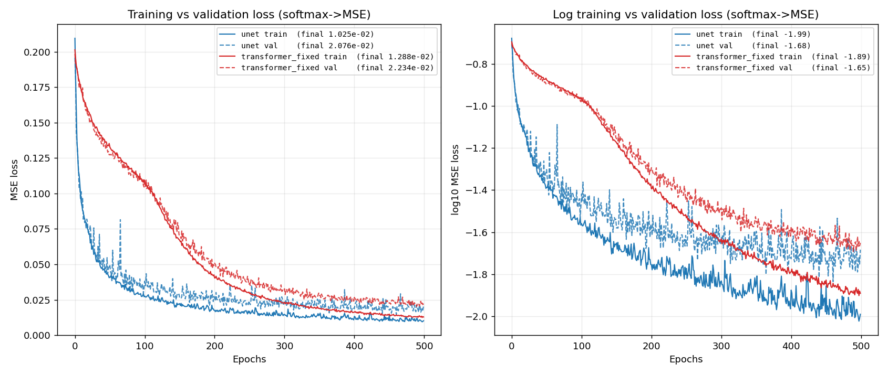

# Detecting landmarks of aircraft in the Aerofly RC10 Simulator

In this project, I constructed different deep learning architectures **from scratch** to extract landmark locations from images of an F16 aircraft in a remote-control flight simulator.

Here is an example.

**Nose** is the nose of the aircraft, **L** is the left wingtip, **R** is the right wingtip, **T** is the tail point, and **V** is the tip of the vertical stabilizer.

This work uses heatmap regression, in which a photo of the aircraft is taken as an input and the output is a set of 5 heatmaps -- each heatmap is a likelihood distribution for where the corresponding landmark is in the image. Since there are 5 landmarks to detect (nose tip, left wing tip, right wing tip, rear end, vertical stabilizer tip), the model predicts 5 heatmaps.

__Unet Landmarks__

__ViT Landmarks__

# Get started

Install PyTorch for MacOS.
The following is run entirely locally, on an M3 Pro chip.

Video demo: first, check if you have the `model_output_090826_128x128_unet` and the `model_output_090826_128x128_transformer_fixed` directories, with the appropriate checkpoints.
* UNet: `python video_demo.py unet_config.json`
* ViT: `python video_demo.py vit_config.json`

To train these models:
* UNet: `python train_model.py unet_config.json`
* ViT: `python train_model.py vit_config.json`

# Repo details

The training + inference flow in the top level (consisting of `.py` scripts) were constructed from the self-sufficient notebooks `exploration/unet_with_supervision_stacked.ipynb` and `exploration/vit3.ipynb` that I wrote myself, for modularity and reducing redundant code.

# Model details:

**UNet**: a single-stage hourglass, 4 downscales & upscales (16 -> 16 -> 32 -> 64 -> 128 channels at the bottleneck, mirrored back up), with a skip connection concatenating each encoder level onto the matching decoder level, and 10.4M parameters. Each level pairs a 5x5 convolution with a dilated 7x7 one under BatchNorm + LeakyReLU. Separately from those skip connections, every downsample and upsample carries an internal residual branch that is *added* rather than concatenated: a strided convolution summed with a max-pooled 1x1 projection on the way down, a transposed convolution summed with a nearest-neighbour upsampled one on the way up. The final 1x1 convolution produces the 5 landmark heatmaps at full `model_image_size` resolution, which a spatial softmax turns into probability maps where each heatmap sums to 1.

**ViT**: a 3-layer vision transformer over 16x16 = 256 tokens, 4.6M parameters. A fixed, frozen 8x8 identity convolution slices the 128x128 input into non-overlapping patches (3x8x8 = 192 values per patch), a 1x1 convolution projects those to a 256-dimensional embedding, and a learnable absolute position encoding is added once before the stack. Each layer is 4-head self-attention over all 256 tokens, with layer-norm on input, and scaled by 256 instead of sqrt(256), followed by a residual-plus-layer-norm merge with the layer input, then a 3-layer 1x1-convolution MLP carrying its own residual branch, with a BatchNorm between layers. Three stride-2 transposed convolutions decode the 16x16 token grid back to full resolution (256 -> 64 -> 16 -> 5 channels), producing the same 5 heatmaps as the UNet. Excluding the patch encoder and the decoder layers, this ViT uses only 1x1 convolutions, so local features come from per-patch FFNs and all cross-patch reasoning, which includes telling the left wingtip from the right, comes from dot-product attention.

# Dataset

The folder `plane_data` contains images and their respective labeled points in CSV format. The folder `outp` visualizes these labelings, containing the original image and the annotated image. I labeled 900 frames in a 20-minute screen-recorded video, with the help of `label_video_multipoint.py` that enables the user to pan through a video frame-by-frame and click points on landmarks so that their locations are saved in CSV format.

The model is trained on these (input, output) image pairs:
* input: an image of dimension `(3, model_image_size, model_image_size)`, with values in the range (-1, 1).
* outputs: an image of dimension `(5, model_image_size, model_image_size)`, where each of the 5 images is a probability map whose values sum to 1. The target for each probability map is $N(\mu, \sigma^2)$ where $\mu$ is the pixel coordinates of the landmark, and $\sigma \approx 5$ pixels. See `coord_to_heatmap()` for implementation details.

# Data Augmentation

Because the pixels in images of the training data comprise a limited set of colors (namely blue, white, and red), I perform data augmentation color-wise using the `RandomColorMatrix` class, which performs linear transformations over the (R, G, B) space with restricted spectral norm. 

I also use the `RandomAffineWithPoints` class to transform images through a composition of rotations, scaling, translations, and shears, and a `RandomAdditiveNoise` to add noise to the images. 

# Model comparison

UNet achieve a marginally better loss (training & validation) over 500 epochs than ViT.

# Future work

* Dropping out chunks of the original image, so that the model can more robustly deduce landmark location by using surrounding features.
* Model ablations to find the smallest & most efficient model architecture that maintains prediction accuracy.
* Create a coordinate regression model (which directly predicts the coordinates of the landmarks instead of inferring them from probability heatmaps), for comparison with the existing approaches.
* To eliminate the bottleneck of manually labeling data, investigate unsupervised learning methods for segmenting images, with the goal of predicting landmark locations for other kinds of aircraft.
* To improve the accuracy of the model for images where the background has nontrivial textures (e.g. terrain, clouds), fill the background of airplane dataset images with randomly chosen images from ImageNet dataset when training.
* Train a Recurrent Neural Network to predict the present position, altitude, & attitude of the aircraft, given the sequence of previous time-varying remote control inputs, to essentially replace the simulator; if there's no way to programmatically extract the raw position, altitude, & attitude information directly from the simulator, this would require using screen recordings of the reported position & altitude numbers and recordings of the plane itself, on which the landmark model would be applied to derive the attitude.
